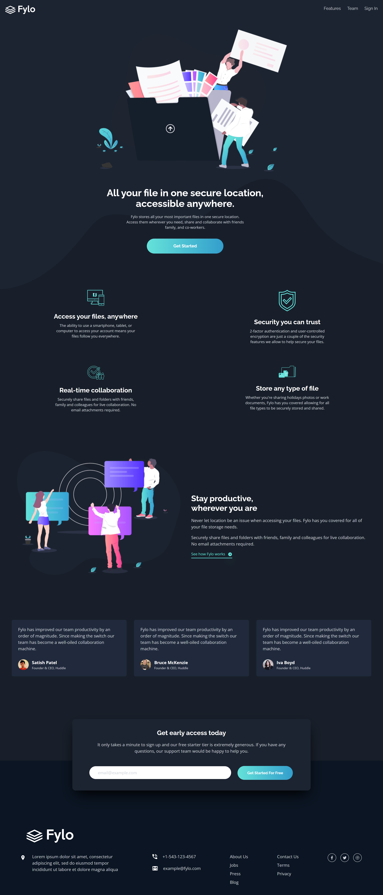
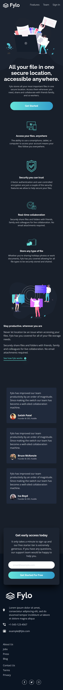

# Frontend Mentor - Fylo dark theme landing page solution

This is a solution to the [Fylo dark theme landing page challenge on Frontend Mentor](https://www.frontendmentor.io/challenges/fylo-dark-theme-landing-page-5ca5f2d21e82137ec91a50fd). Frontend Mentor challenges help you improve your coding skills by building realistic projects.

## Table of contents

- [Frontend Mentor - Fylo dark theme landing page solution](#frontend-mentor---fylo-dark-theme-landing-page-solution)
  - [Table of contents](#table-of-contents)
  - [Overview](#overview)
    - [The challenge](#the-challenge)
    - [Screenshot](#screenshot)
    - [Links](#links)
  - [My process](#my-process)
    - [Built with](#built-with)
    - [Continued development](#continued-development)
  - [Author](#author)

## Overview

### The challenge

Users should be able to:

- View the optimal layout for the site depending on their device's screen size
- See hover states for all interactive elements on the page
  
### Screenshot

### Links

- Solution URL: [Solution URL here](https://www.frontendmentor.io/solutions/fylo-dark-theme-landing-using-react-and-tailwind-82TbMOJBRa)
- Live Site URL: [Live site URL here](https://fylo-dark-theme-page-iota.vercel.app/)

## My process

### Built with

- Semantic HTML5 markup
- [Tailwind](https://tailwindcss.com/)
- [React](https://reactjs.org/) - JS library

### Continued development

Creating more projects with React and Tailwind CSS.

## Author

- Website - [Ronen Hammond](https://ronenhammond.netlify.app/)
- Frontend Mentor - [@Ronen_T_G](https://www.frontendmentor.io/profile/RonenTGreat)
- Twitter - [@Ronen_T_G](https://twitter.com/Ronen_T_G)
